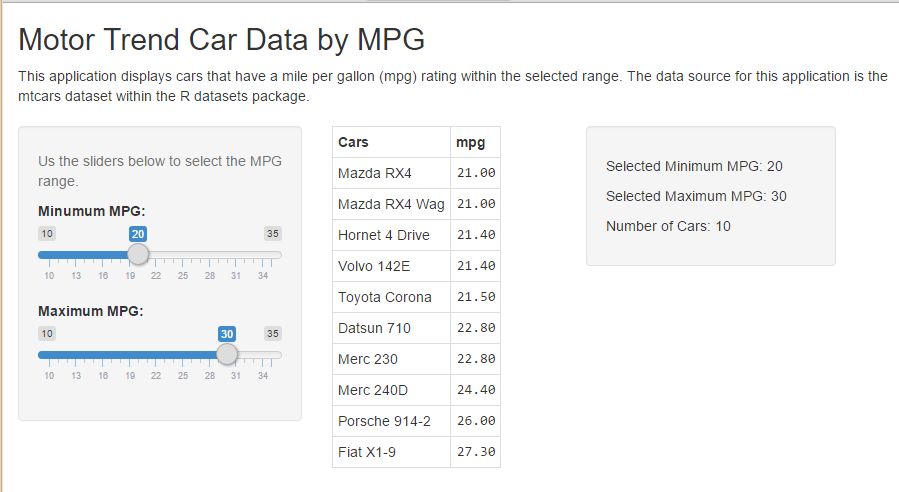

Motor Trend Car Data by MPG
========================================================
author: Christopher Hardison
date: September 6, 2016
autosize: true
transition: rotate
width: 1440
height: 900

<small>
Course Project<br>
Developing Data Products<br>
Coursera Data Science Specialization<br>
</small>


Description of Application
========================================================
type: section

Presenting the perfect way to select the right car. This application allows the user to see the cars that have a MPG rating within the values they configure by using the slider inputs. There is one slider for minimum MPG and one for maximum MPG. Cars with a rating that falls between the selected values for those are displayed.





App Location
========================================================
type: section


- The applicaion can be accessed online at:
<https://crhardison.shinyapps.io/Developing_Data_Products_Course_Project/>

- The code for the application can be found on GitHub at:
<https://github.com/crhardison/Developing-Data-Products-Course-Project>


Data Source
========================================================
type: section


The data source for the application is the mtcars dataset within the R datasets package. Here we show a sample of the data.


```r
head(mtcars)
```

```
                   mpg cyl disp  hp drat    wt  qsec vs am gear carb
Mazda RX4         21.0   6  160 110 3.90 2.620 16.46  0  1    4    4
Mazda RX4 Wag     21.0   6  160 110 3.90 2.875 17.02  0  1    4    4
Datsun 710        22.8   4  108  93 3.85 2.320 18.61  1  1    4    1
Hornet 4 Drive    21.4   6  258 110 3.08 3.215 19.44  1  0    3    1
Hornet Sportabout 18.7   8  360 175 3.15 3.440 17.02  0  0    3    2
Valiant           18.1   6  225 105 2.76 3.460 20.22  1  0    3    1
```

Data Source Cont.
========================================================
type: section

Here we see the complete list of cars which the app can display.


```r
rownames(mtcars)
```

```
 [1] "Mazda RX4"           "Mazda RX4 Wag"       "Datsun 710"         
 [4] "Hornet 4 Drive"      "Hornet Sportabout"   "Valiant"            
 [7] "Duster 360"          "Merc 240D"           "Merc 230"           
[10] "Merc 280"            "Merc 280C"           "Merc 450SE"         
[13] "Merc 450SL"          "Merc 450SLC"         "Cadillac Fleetwood" 
[16] "Lincoln Continental" "Chrysler Imperial"   "Fiat 128"           
[19] "Honda Civic"         "Toyota Corolla"      "Toyota Corona"      
[22] "Dodge Challenger"    "AMC Javelin"         "Camaro Z28"         
[25] "Pontiac Firebird"    "Fiat X1-9"           "Porsche 914-2"      
[28] "Lotus Europa"        "Ford Pantera L"      "Ferrari Dino"       
[31] "Maserati Bora"       "Volvo 142E"         
```

